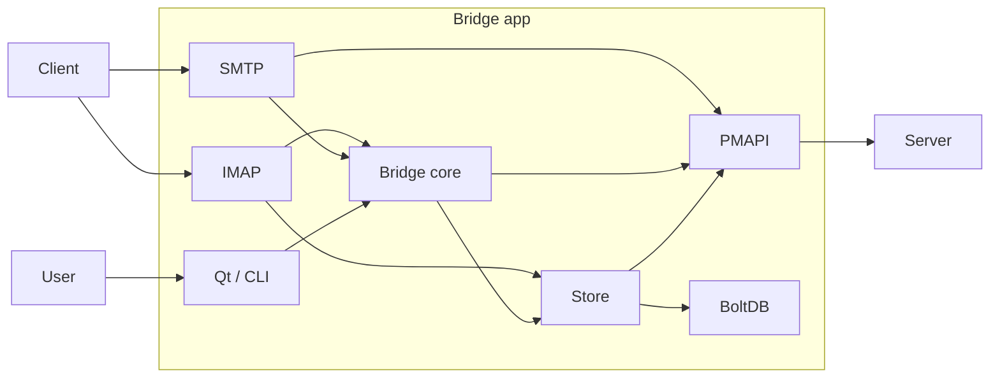
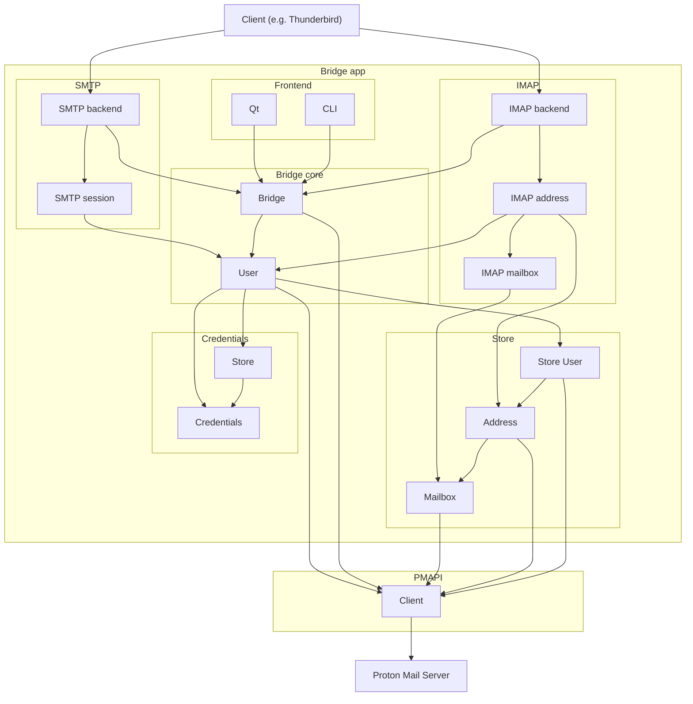

# Bridge

## Main blocks

This is basic overview of the main bridge blocks.

Note connection between IMAP/SMTP and PMAPI. IMAP and SMTP packages are in the queue to be refactored
and we would like to try to have functionality in bridge core or bridge utilities (such as messages)
than direct usage of PMAPI from IMAP or SMTP. Also database (BoltDB) should be moved to bridge core.

## Code structure

More detailed graph of main types used in Bridge app and connection between them. Here is already
communication to PMAPI only from bridge core which is not true, yet. IMAP and SMTP are still calling
PMAPI directly.

## How to debug

Run `make run-debug` which starts [Delve](https://github.com/go-delve/delve).
