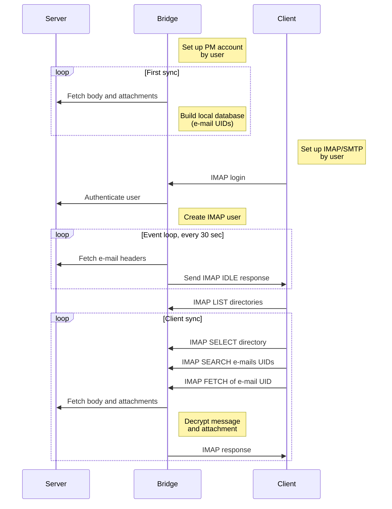
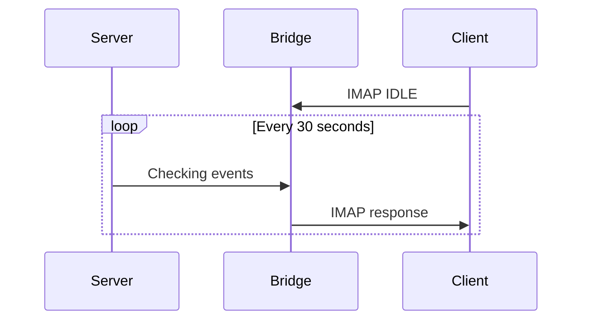
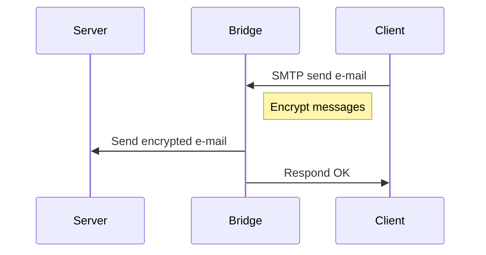

# Communication

## First login and sync

When user logs in to the bridge for the first time, immediately starts the first sync.
First sync downloads all headers of all e-mails and creates database to have proper UIDs
and indexes for IMAP. See [database](database.md) for more information.

By default, whenever it's possible, sync downloads only all e-mails maiblox which already
have list of labels so we can construct all mailboxes (inbox, sent, trash, custom folders
and labels) without need to download each e-mail headers many times.

Note that we need to download also bodies to calculate size of the e-mail and set proper
content type (clients uses content type for guess if e-mail contains attachment)--but only
body, not attachment. Also it's downloaded only for the first time. After that we store
those information in our database so next time we only sync headers, labels and so on.

First sync takes some time. List of 150 messages takes about second and then we need to
download bodies for each message. We still need to do some optimalizations. Anyway, if
user has reasonable amount of e-mails, there is good chance user will see e-mails in the
client right after adding account.

When account is added to client, client start the sync. This sync will ask Bridge app
for all headers (done quickly) and then starts to download all bodies and attachment.
Unfortunately for some e-mail more than once if the same e-mail is in more mailboxes
(e.g. inbox and all mail)--there is no way to tell over IMAP it's the same message.

After successful login of client to IMAP, Bridge starts event loop. That periodicly ask
servers (each 30 seconds) for new updates (new message, keys, …).

## IMAP IDLE extension

IMAP IDLE is extension, it has to be supported by both client and server. IMAP server (in our case
the bridge) supports it so clients can use it. It works by issuing `IDLE` command by the client and
keeps the connection open. When the server has some update, server (the bridge) will respond to that
by `EXISTS` (new message), `APPEND` (imported message), `EXPUNGE` (deleted message) or `MOVE` response.

Even when there is connection with IDLE open, server can mark the client as inactive. Therefore,
it's recommended the client should reissue the connection after each 29 minutes. This is not the
real push and can fail!

Our event loop is also simple pull and it will trigger IMAP IDLE when we get some new update from 
the server. Would be good to have push from the server, but we need to wait for the support on API.

RFC: https://tools.ietf.org/html/rfc2177

## Sending e-mails

E-mail are sent over standard SMTP protocol. Our bridge takes the message, encrypts and sent it
further to our server which will then send the message to its final destination. The important
and tricky part is encryption. See [encryption](encryption.md) or [PMEL document](https://docs.google.com/document/d/1lEBkG0DC5FOWlumInKtu4a9Cc1Eszp48ZhFy9UpPQso/edit)
for more information.

