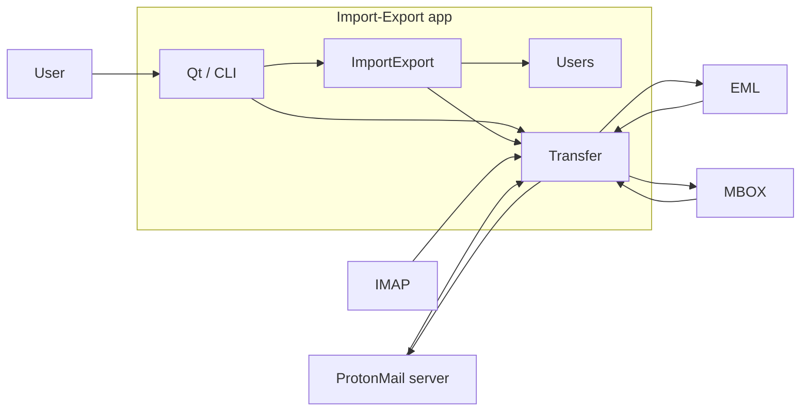
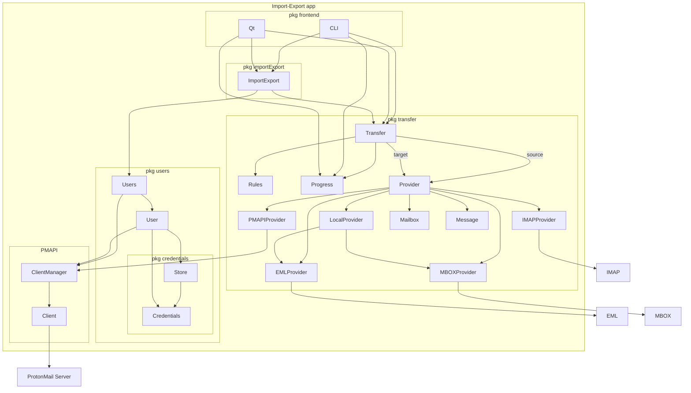

# Import-Export app

## Main blocks

This is basic overview of the main Import-Export blocks.

## Code structure

More detailed graph of main types used in Import-Export app and connection between them.

