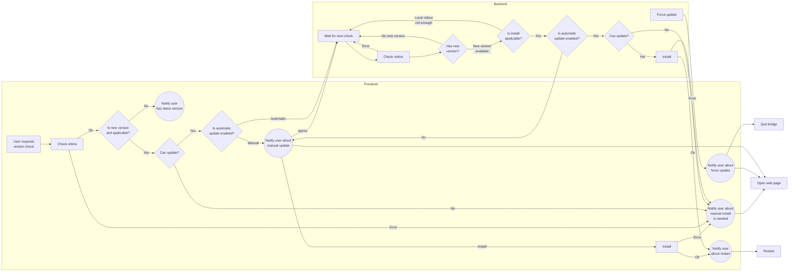

# Update mechanism of Bridge

There are multiple options how to change version of application:
* Automatic in-app update
* Manual in-app update
* Manual install

In-app update ends with restarting bridge into new version. Automatic in-app
update is downloading, verifying and installing the new version immediately
without user confirmation. For manual in-app update user needs to confirm first.
Update is done from special update file published on website.

The manual installation requires user to download, verify and install manually
using installer for given OS.

The bridge is installed and executed differently for given OS:

* Windows and Linux apps are using launcher mechanism:
    * There is system protected installation path which is created on first
      install. It contains bridge exe and launcher exe. When users starts
      bridge the launcher is executed first. It will check update path compare
      version with installed one. The newer version then is then executed.
    * Update mechanism means to replace files in update folder which is located
      in user space.

* macOS app does not use launcher
    * No launcher, only one executable
    * In-App update replaces the bridge files in installation path directly

The non-trivial is to combine the update with setting change:
* turn off/on automatic in-app updates
* change from stable to beta or back

_TODO fill flow chart details_

We are not support downgrade functionality. Only some circumstances can lead to
downgrading the app version.

_TODO fill flow chart details_
