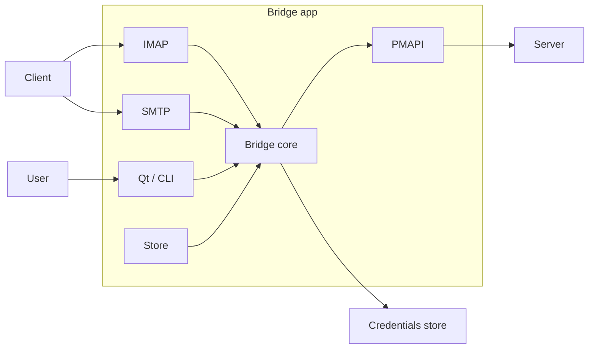

# Integration tests

This folder contains integration tests of the Bridge app.

## What and how we are testing



We want to test Bridge app from outside as much as possible. So we mock server (API),
credentials store and call commands to IMAP or SMTP the same way as client would do.

## Example test

BDD test in gherkin (cucumber) format (https://cucumber.io/docs/gherkin/reference/).

```
Feature: IMAP update messages
  Background:
    Given there is connected user "user"
    And there are messages in mailbox "INBOX" for "user"
      | from              | to         | subject | body  | read  | starred |
      | john.doe@mail.com | user@pm.me | foo     | hello | false | false   |
      | jane.doe@mail.com | name@pm.me | bar     | world | true  | true    |
    And there is IMAP client logged in as "user"
    And there is IMAP client selected in "INBOX"

  Scenario: Mark message as read
    When IMAP client marks message "1" as read
    Then IMAP response is "OK"
    And message "1" in "INBOX" for "user" is marked as read
    And message "1" in "INBOX" for "user" is marked as unstarred
```

Is translated into code with godog (https://github.com/cucumber/godog/).

```go
// Registration
func FeatureContext(s *godog.Suite) {
	s.Step(`^there is connected user "([^"]*)"$`, thereIsConnectedUser)
}

// Godog step function
func thereIsConnectedUser(username string) error {
	account := ctx.GetTestAccount(username)
	if account == nil {
		return godog.ErrPending
	}
	ctx.GetPMAPIController().AddUser(account.User, account.Addresses)
	return ctx.LoginUser(account.Username(), account.Password(), account.MailboxPassword())
}
```

## BDD

BDD has three parts:

* `Given` (setup),
* `When` (action)
* and `Then` (check).

Setup has to prepare context and always end without error. Action, on
the other hand, needs to always end without error, but store it in 
the context. Check should analyze the status of the bridge, store or
API and also check whether something failed before.

Therefore we cannot use a sentence such as `there is user` for both
setup and check steps. We always begin setup steps with `there is/are`,
while check steps are written in the form `something is/has feature`.
Actions are written in the form `something does action`. By doing this
we can always be sure what each steps does or should do.

In the code, we separate those parts in its own files to make sure
it's clear how the function should be implemented.

## API faked by fakeapi or liveapi

We need to control what server returns. Instead of using raw JSONs,
we fake the whole pmapi for local testing. Fake pmapi behaves as much
as possible the same way as real server, but does not follow every
single detail. Otherwise we would end up with writing complete server. :-)

For both -- fake local pmapi and real live server -- we use controller.
Controller is available on test context and does setup like setting up
internet connection, user settings, labels or messages.

Accounts for each environment are set up in `accounts` folder. Each
test function should use `TestAccount` object obtained by test ID
(such as `user` or `userMultipleAddress` for users, or `primary`
or `secondary` for addresses) and use available functions to get real
IDs (even if fake API uses the test IDs as real ones).

Testing against live is using real users and doesn't work in parallel.
Only one job against live at a time can be running.

## External e-mail accounts

We have some external accounts which we are using for testing:

* pm.bridge.qa@gmail.com
* bridge-qa@yandex.ru
* bridgeqa@seznam.cz

For access, ask bridge team.
